% Gimp Tutorial
% Jakobus Schürz
% Jänner 2017

# Arbeitsaufgabe
vorher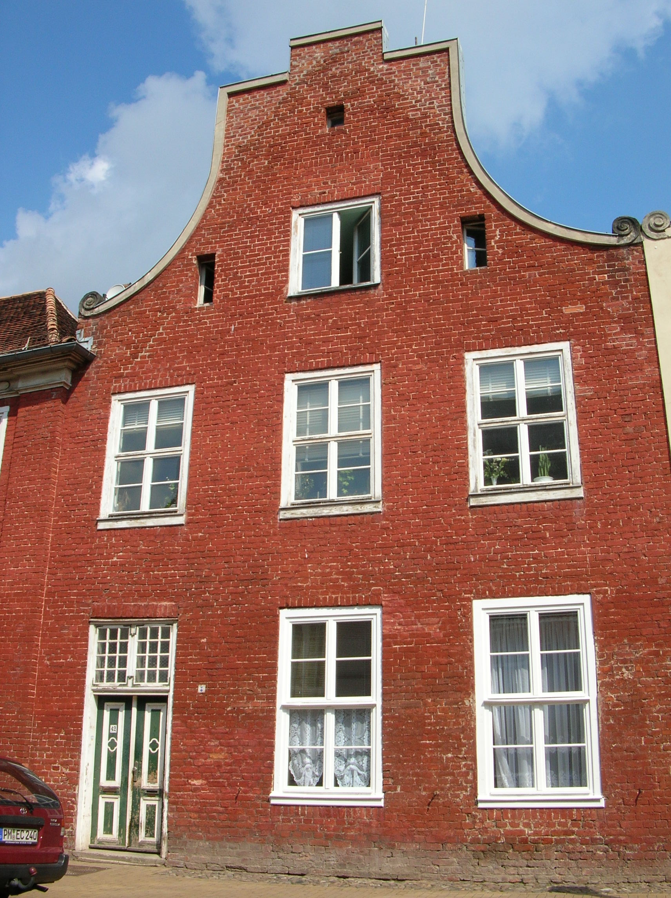{width=300px rwidth=5cm}
nachher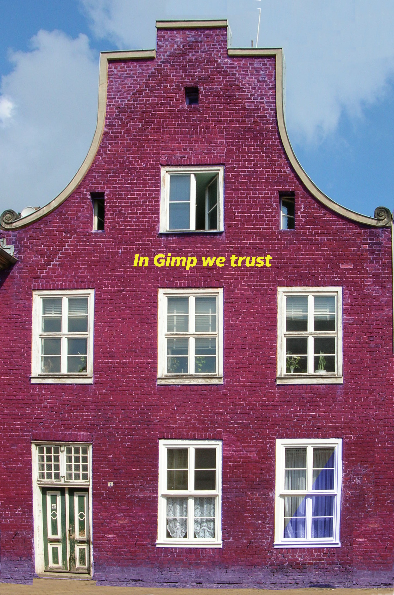{width=300px rwidth=5cm}

# Toolbox
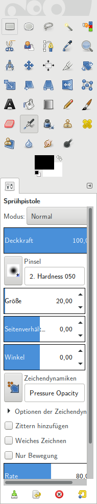

# Öffnen/Erstellen

##
A | B | C
:---: |:--- | ---:
Daslsöldkf | E | Fadsf
Gsdlk jdaslf | Hsafj | I

- Öffnen einer Bilddatei (*.jpg, *.png, *.tiff,...)
- Importieren (*.pdf, *.ps, *.psd,...)
- Screenshot

##
Gimp ist ein Programm für Rastergrafik. Das Bild besteht aus einzelnen Bildpunkten.

Vectorgraphiken (*.svg), PDF, *.eps, Photoshop (*.psd) werden beim Importieren in der angegebenen Auflösung "gerastert"

##
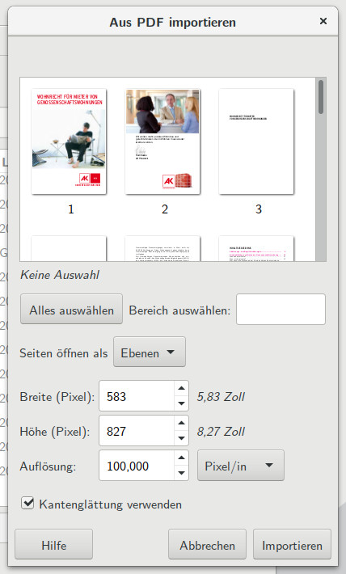{height=350px rheight=7cm}

##
- Auflösung wählen (zum Drucken mindestens 300dpi = Pixel pro Inch)
- Größe wählen
- Die zu importierenden Seiten anklicken
- Import als Ebenen in einem Bild oder
- Import als Einzelbilder

# Perspektive

##
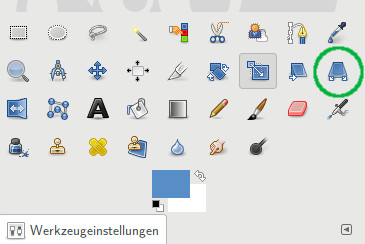{height=300px rheight=7cm}

##
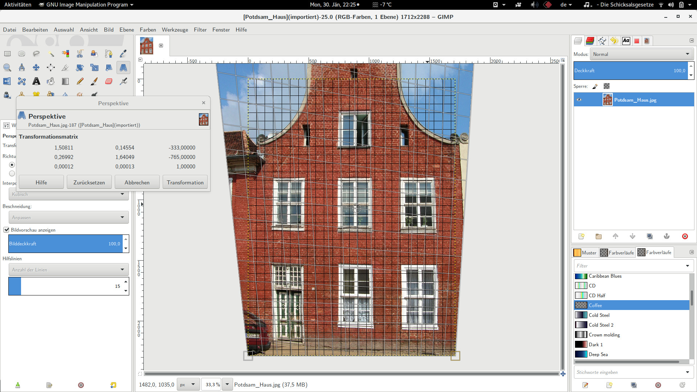{height=300px rheight=7cm}

Das Haus am Raster mit der Maus "zurechtschieben"
Abschließen mit "Enter" oder "Transformation"

# Ebenen/Leinwand

##
- Metapher "Overheadprojektor"
- Leinwand ist wie die beleuchtete Glasfläche
- Ebenen sind wie Folien(schnipsel) darauf

##
{height=300px rheight=7cm}

##
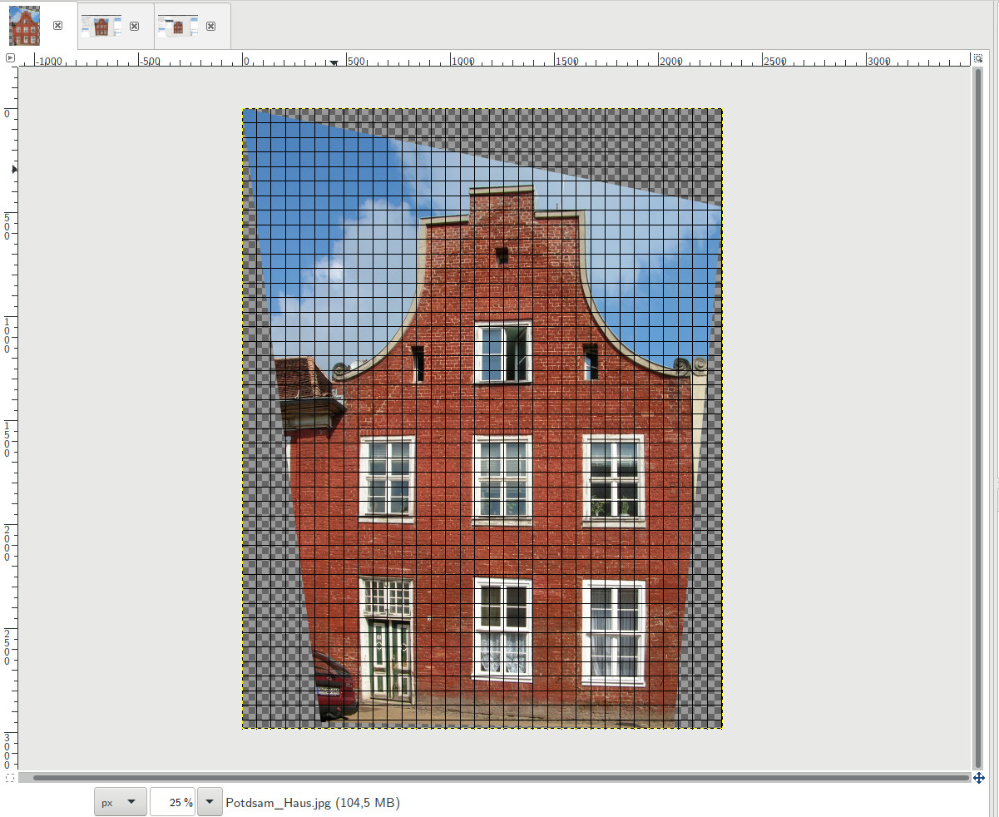{height=300px rheight=7cm}

# Zuschneiden

##
{height=420px rheight=7cm}

##
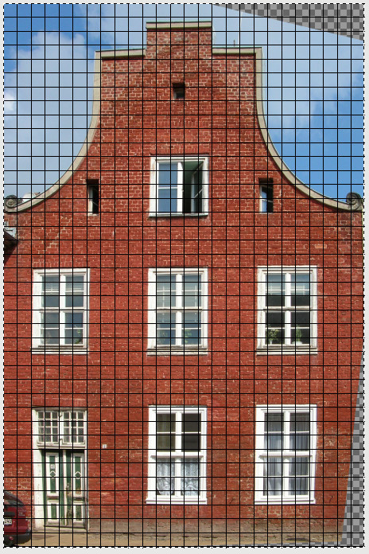{height=400px rheight=7cm}

# Klonen / Heilen

##
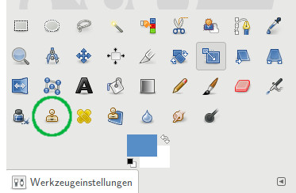{height=150px rheight=4cm}

- Heilen ist wie Klonen, nur ist ein weicherer Überlagerungseffekt wirksam.
- Klonen z.B. bei Gebäuden
- Heilen um Falten/Pickel in Gesichtern zu entfernen

##
- Beim Klonen (Stempelsymbol) oder Heilen (Heftpflastersymbol) die Form des Stempels festlegen/einrichten.
- Mit <Strg>+linker Mausklick die originale Position (von der aus geklont werden soll) festlegen.
- Mit linkem Mausklick am Ziel das Original einfügen (durch ziehen mit gedrückter Maustaste wird der Bereich vergrößert)

##
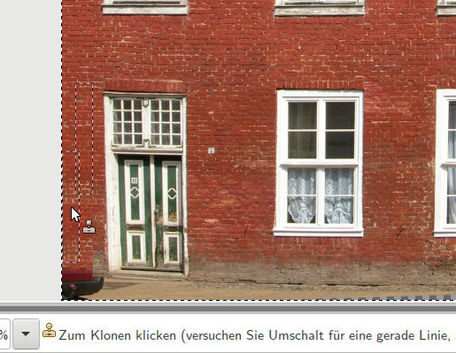{height=350px rheight=7cm}

##
{height=350px rheight=7cm}

##
{height=350px rheight=7cm}

##
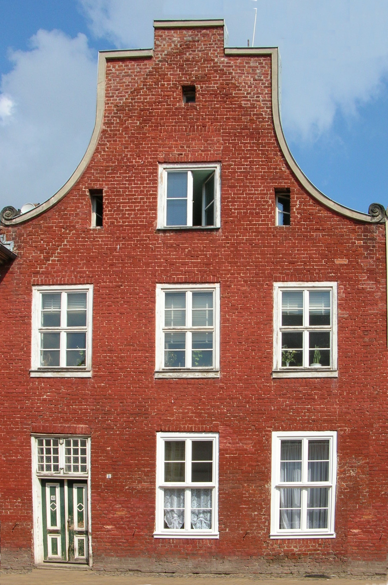{height=450px rheight=7cm}

# Markieren

##

##
- Mit der linken Maustaste markieren
- Markierung erweitern: <Shift> +  linke Maustaste
- Zusammenhängende Bereiche mit dem Zauberstab
- Nach Farbe markieren - alle Bereiche der selben Farbe

##
{height=400px rheight=7cm}

##
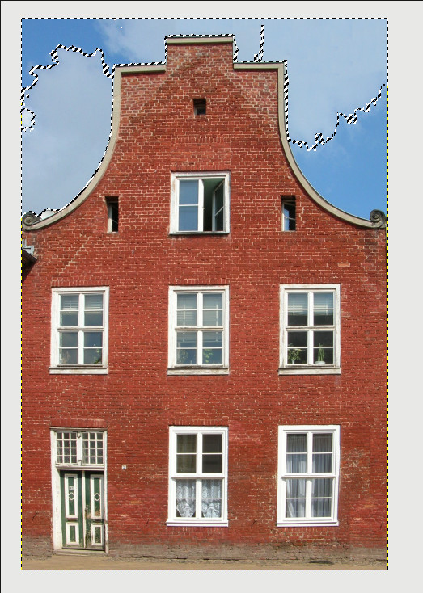{height=400px rheight=7cm}

Markierung ergänzen mit \<Strg\> + Mausklick

##
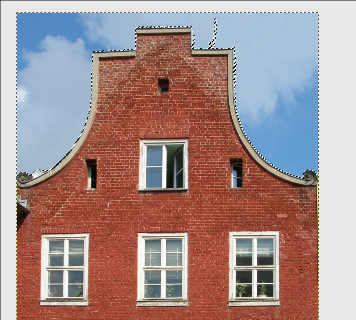{height=400px rheight=7cm}

##
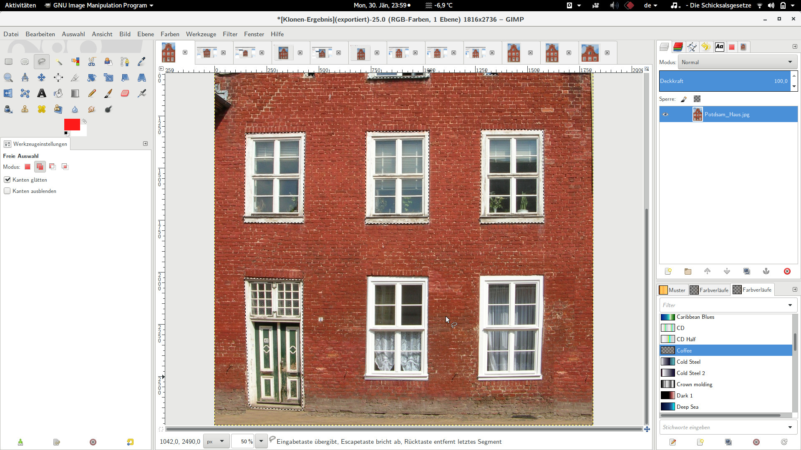{height=400px rheight=7cm}

##
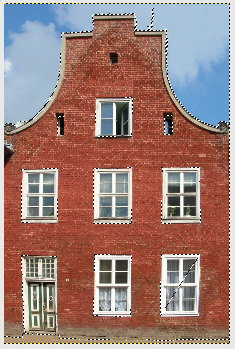{height=400px rheight=7cm}

# Ebenen

##
{height=300px rheight=7cm}
{height=300px rheight=7cm}

- Auge: Ebene ist sichtbar
- Kette: Ebene ist gegen veränderung geschützt

# Farbänderung

##
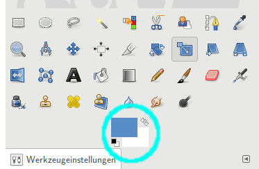{height=300px rheight=7cm}
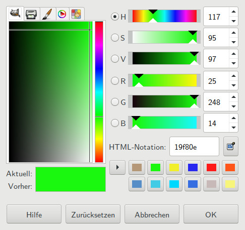{height=300px rheight=7cm}

##
- Ebene auswählen, auf der die Einfärbung passieren soll
- Einfärbung findet nur innerhalb der aktuellen Auswahl statt
- Mit linker Maustaste aus Farbwahl in das Bild ziehen füllt die Auswahl

##
{height=300px rheight=7cm}

##
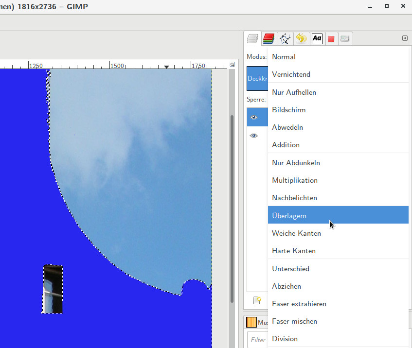{height=300px rheight=7cm}

##
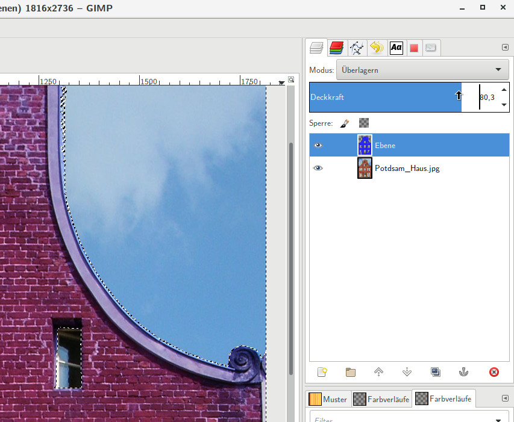{height=300px rheight=7cm}

##
{height=340px rheigth=5cm}
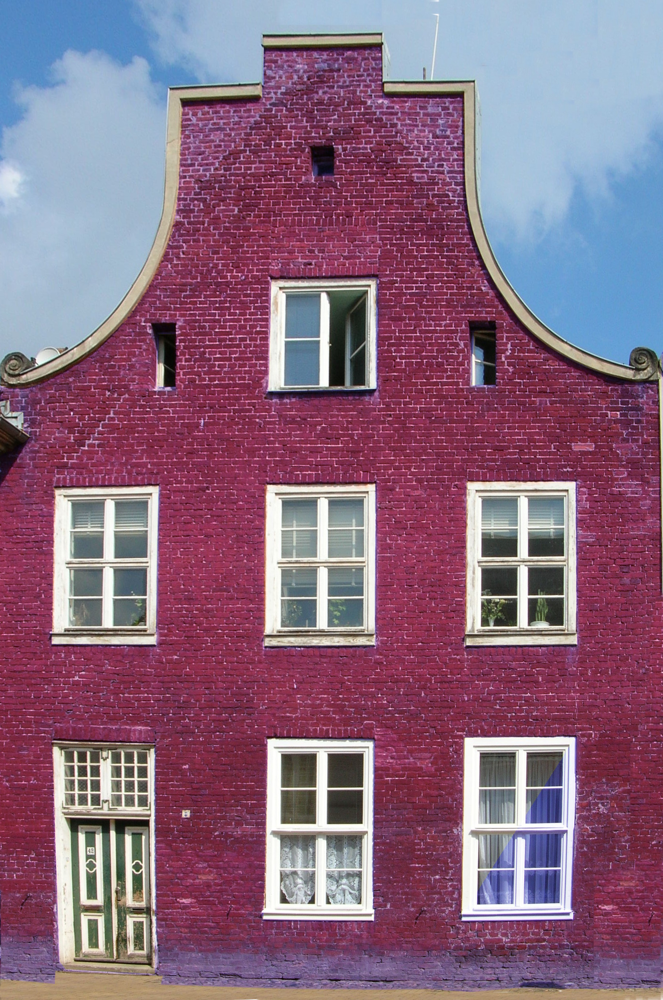{height=340px rheigth=5cm}

##
{height=340px rheigth=5cm}
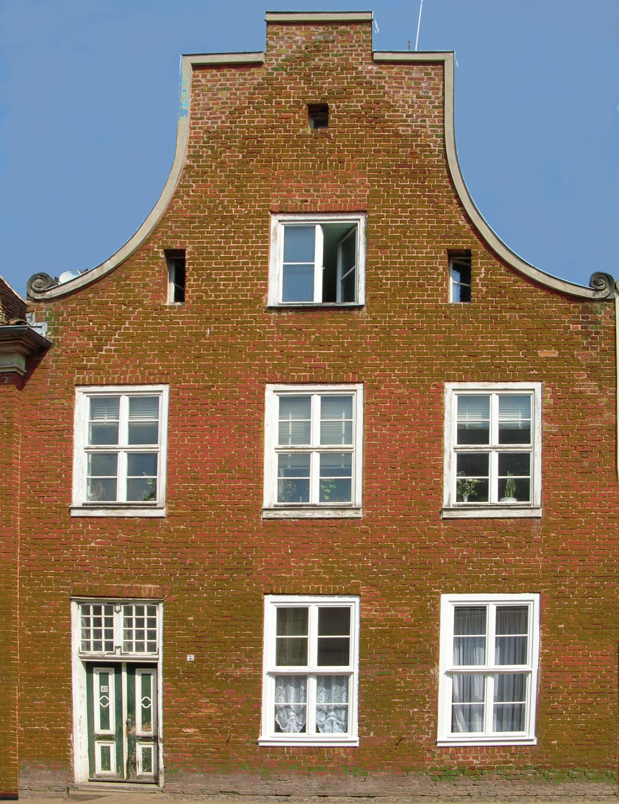{height=340px rheigth=5cm}

Mit Farbauswahl ausgewählt, mit Grün überlagert

# Text

##
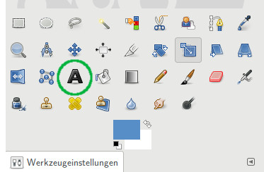{height=300px rheight=7cm}

##
- Schriftart (Font)
- Farbe
- Position
- Zeichenabstand

##
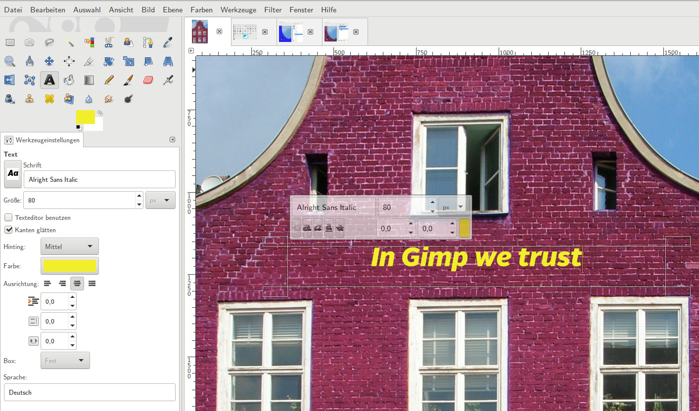{height=300px rheight=7cm}

##
{height=350px rheight=7cm}

# Speichern

##
- im Menü "Datei"
- "Speichern"/"Speichern unter" nur im Gimp-eigenen Format .xcf
- beim Speichern keine weiteren Angaben notwendig
- xcf kann in der Regel nur von Gimp geöffnet/angezeigt werden

##
- im Menü "Datei"
- "Speichern"/"Speichern unter" nur im Gimp-eigenen Format .xcf
- "Exportieren" in jpg, png, pdf, psd... 
- beim Exportieren die Parameter je nach Exportformat wählen!!

##
{heigth=300py rheight=5cm}

# Weiterführende Hilfe

##
<https://docs.gimp.org/de/>

<https://www.youtube.com/user/gimptutorialdeutsch>

# Videotutorials 

## Freistellen von Objekten
<iframe width="560" height="315" src="https://www.youtube.com/embed/67gt2xlkYN8" frameborder="0" allowfullscreen></iframe>

## Freistellen vor unruhigem Hintergrund
<iframe width="560" height="315" src="https://www.youtube.com/embed/MCZyjJ2Ps4Y" frameborder="0" allowfullscreen></iframe>

# Vielen Dank für die Aufmerksamkeit!

#
erstellt mit

- [Debian GNU/Linux] <http://www.debian.org>
- [Gimp] <https://www.gimp.org/>
- [pandoc] <http://pandoc.org/>
- [reveal.js] <https://github.com/xundeenergie/reveal.js>

&copy; 2017 Jakobus Schürz
